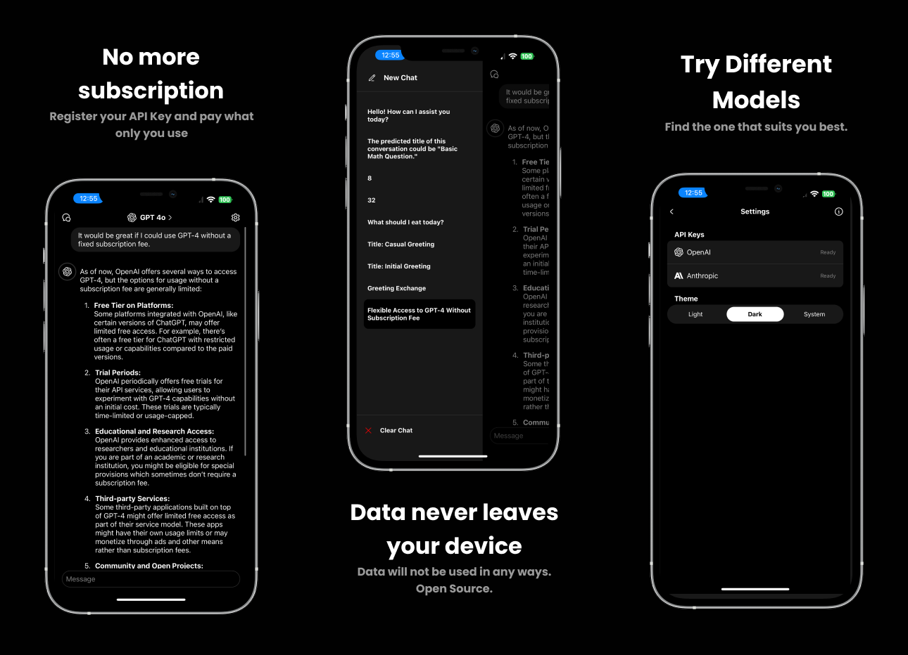

## ChatAPI

  

- **State:** Production
- **Developer:** [Jay Cho](https://github.com/jaycho1214)

## Introduction

> "I don't think I'm fully utilizing the $20 for ChatGPT Plus."

**Introducing ChatAPI**—an open-source app that allows you to easily use the ChatGPT API and other large language model (LLM) APIs within your app.

- **No data collected:** All your data is securely stored on your device.
- **Completely FREE:** No ads, subscriptions, or in-app purchases.

## License

This project is licensed under the MIT License. See [LICENSE](LICENSE) for details.
